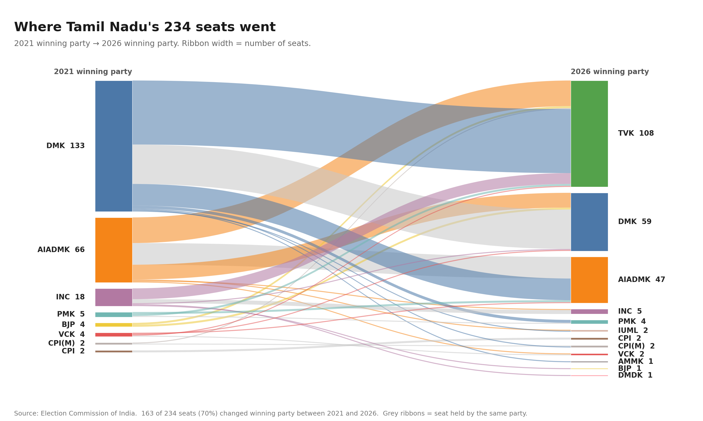
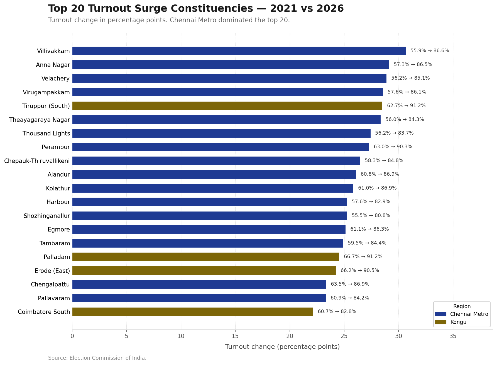
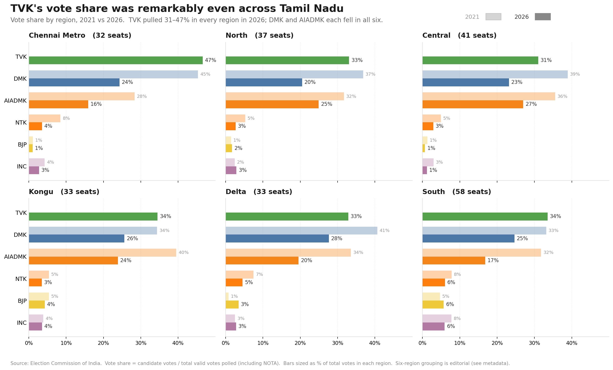
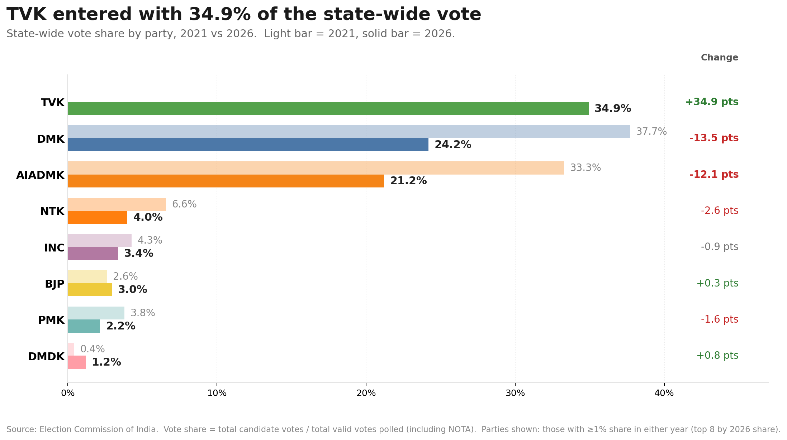
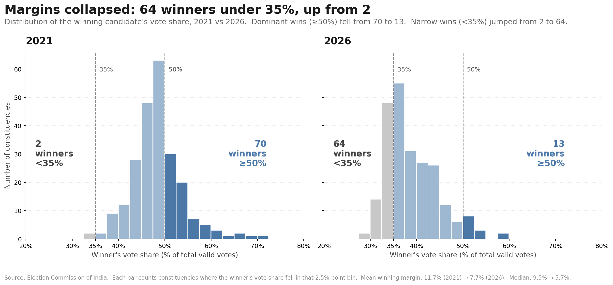

# 🗳️ Decoding the 2026 Tamil Nadu Assembly Election


### AtliQ Media Resume Project Challenge (Codebasics RPC #21)

Data storytelling on the 2026 Tamil Nadu Legislative Assembly Election results. Built for the Codebasics Resume Project Challenge as a pitch to a fictional news network (AtliQ Media) producing a one-hour TV show on the election.

## 📊 Key Numbers at a Glance

| | | | |
|:---:|:---:|:---:|:---:|
| 🏛️ **234** | 🔄 **163** | 🟢 **71** | 📈 **86.2%** |
| Constituencies | Seats Flipped | Seats Retained | Avg Turnout 2026 |
| All of Tamil Nadu | 69.7% changed party | Same party both years | ↑ from 73.4% in 2021 |
| | | | |
| 📊 **+12.8 pp** | 🗳️ **4.91 Cr** | ⚡ **+30.8 pp** | 🎯 **1 vote** |
| Statewide Surge | Total Votes Cast | Biggest Turnout Jump | Closest Margin |
| Record turnout election | vs 4.59 Cr in 2021 | Villivakkam, Chennai | Tiruppattur (Sivaganga) |

---

## 🚀 Live Dashboard

[](https://Movva918-tn-election-2026.streamlit.app)

---

## 📊 Story 1 — Where the 234 Seats Went

*163 of 234 seats (70%) changed winning party. Grey ribbons = seats held by theß same party.*



---

## 📈 Story 2 — The Turnout Surge

*Chennai Metro dominated the top 20 biggest turnout risers — constituencies that were the state's lowest in 2021 became mid-pack in 2026.*



---

## 🗺️ Story 3 — Vote Share Across All Six Regions

*TVK pulled 31–47% in every region. DMK and AIADMK each fell in all six.*



---

## 📉 Story 4 — State-Wide Vote Share Shift

*TVK entered at 34.9%. The two parties that previously split ~70% of the vote each shed more than 12 points.*



---

## ⚖️ Story 5 — Margins Collapsed

*In 2021, 84 winners crossed 50% vote share. In 2026, only 14 did. The election became a multi-way contest in nearly every constituency.*



---


## Project Structure

<details>
<summary>📁 Click to expand</summary>

```
TN-Election-2026/
│
├── README.md                           # Project overview, setup, key findings
├── requirements.txt                    # Python dependencies
├── run_all.py                          # Master pipeline — runs all scripts in order
├── charts                              # PNG charts — rendered inline in this README
├── src/                                # Shared utilities
│   ├── __init__.py
│   ├── clean.py                        # Data cleaning helpers
│   ├── metrics.py                      # Shared metric functions
│   └── charts.py                       # Shared charting utilities
│
├── 00_data_loader.py                   # Step 0 — load & merge all raw CSVs (run first)
│
├── qa/                                 # Research question scripts
│   ├── 01_q1_turnout_top_bottom.py     # Q1: Top/bottom turnout constituencies
│   ├── 02_q2_same_party_streak.py      # Q2: Seats won by same party both years
│   ├── 03_q3_biggest_flips.py          # Q3: Largest vote-swing flips
│   ├── 04_q4_margin_analysis.py        # Q4: Winning margin distribution
│   ├── 05_q5_q6_vote_share.py          # Q5+Q6: Regional & state vote share
│   ├── 06_q7_nota_analysis.py          # Q7: NOTA voting patterns
│   ├── 07_q8_postal_correlation.py     # Q8: Postal votes correlation
│   └── 08_q9_literacy_correlation.py   # Q9: Literacy vs turnout correlation
│
├── notebooks/                          # Story chapters (narrative deck)
│   ├── 03_story_voteshare.py           # Vote share — state + regional
│   ├── 04_story_flips.py               # Seat flips — Sankey chart
│   ├── 05_story_geography.py           # Seats by region + margins
│   ├── 06_story_turnout.py             # Turnout surge — top 20
│   ├── 07_story_gender.py              # Gender turnout analysis
│   ├── 08_story_women_nota.py          # Women candidates + NOTA
│   └── 09_story_connection.py          # Connective story: surge → TVK
│
├── data/
│   ├── raw/                            # Original ECI source files (unmodified)
│   │   ├── tn_2021_results.csv         # Candidate-level results, 2021 (4,232 rows)
│   │   ├── tn_2026_results.csv         # Candidate-level results, 2026 (4,257 rows)
│   │   ├── constituency_master.csv     # 234 ACs — district, region, reservation status
│   │   ├── gender_2021.csv             # Gender-wise electors & voters, 2021
│   │   ├── voters_2026.csv             # Gender-wise electors & voters, 2026
│   │   ├── electors_2026.csv           # Registered electors by gender, 2026
│   │   ├── postal_2021.csv             # Postal ballot data, 2021
│   │   ├── postal_2026.csv             # Postal ballot data, 2026
│   │   └── women_candidates_raw.csv    # Women candidates — party, votes, win/loss
│   │
│   ├── interim/                        # Mid-pipeline working files
│   └── processed/                      # Final cleaned tables used by scripts
│
├── outputs/
│   ├── charts/                         # All generated PNG charts
│   │   ├── seats_statewide.png
│   │   ├── seats_by_region.png
│   │   ├── voteshare_statewide_neutral.png
│   │   ├── voteshare_by_region.png
│   │   ├── sankey_2021_to_2026.png
│   │   ├── turnout_top20.png
│   │   ├── story_top20_surge_breakdown.png
│   │   ├── story_scatter_turnout_tvk.png
│   │   ├── gender_gap_summary.png
│   │   ├── gender_gap_by_party.png
│   │   ├── gender_gap_regional.png
│   │   ├── gender_scatter.png
│   │   ├── gender_surge_top10.png
│   │   ├── third_gender_turnout.png
│   │   ├── women_win_rate.png
│   │   ├── nota_top15.png
│   │   ├── margins_distribution.png
│   │   ├── q1_turnout_bars.png
│   │   ├── q2_same_party.png
│   │   ├── q3_flips.png
│   │   ├── q4_margins.png
│   │   ├── q5_regional_heatmap.png
│   │   ├── q6_state_swing.png
│   │   ├── q7_nota.png
│   │   ├── q8_postal_scatter.png
│   │   └── q9_literacy_scatter.png
│   │
│   ├── q1_turnout_top_bottom.csv
│   ├── q1_turnout_delta_top10.csv
│   ├── q2_same_party_streak.csv
│   ├── q3_all_flips.csv
│   ├── q3_biggest_flips.csv
│   ├── q4_margins_2021.csv
│   ├── q4_margins_2026.csv
│   ├── q5_regional_share.csv
│   ├── q6_state_share.csv
│   ├── q7_nota_analysis.csv
│   ├── q8_postal_correlation.csv
│   ├── q9_literacy_correlation.csv
│   └── turnout_delta.csv
│
├── dashboard/
│   ├── tn_dashboard_streamlit.py       # Interactive Streamlit app
│   ├── tn_dashboard_light.html         # Standalone HTML dashboard (no server needed)
│   └── sankey_2021_to_2026.html        # Interactive Sankey — party seat flow 2021→2026
│
└── deck/
    └── TN_Election_2026_AtliQ_Media.pdf  # Final stakeholder presentation 
```

</details>

## Setup

```bash
pip install -r requirements.txt
```

## Run

```bash
# Run full pipeline (story + Q&A)
python run_all.py

# Run story chapters only
python run_all.py --story

# Run Q&A deep dives only
python run_all.py --qa

# Resume from a specific step if one fails
python run_all.py --from 05
```

## Raw Data Files Required

Place these in `data/raw/` before running:

| File | Source | Notes |
|---|---|---|
| `tn_2021_results.csv` | Codebasics / ECI via Trivedi Centre (Ashoka) | 4,232 candidate-level rows, 234 ACs |
| `tn_2026_results.csv` | Codebasics / ECI via Trivedi Centre (Ashoka) | 4,257 candidate-level rows, 234 ACs |
| `constituency_master.csv` | Codebasics / TN Chief Electoral Officer | 234 rows, AC → district → region → reservation |
| `voters_2026.csv`, `electors_2026.csv` | ECI Form-20 | Gender-wise electors & voters 2026 |
| `gender_2021.csv` | ECI Form-20 | Gender-wise electors & voters 2021 |
| `postal_2021.csv`, `postal_2026.csv` | ECI Form-20 | Postal ballot data |
| `women_candidates_raw.csv` | ECI Form-20 | Women candidates, party, votes, win/loss |
| Literacy data | Census 2011, Office of the Registrar General | District-level literacy rates |


## Key Findings

| Question | Finding |
|---|---|
| Q1 Turnout | Bottom 5 in 2021 = all Chennai Metro (55–56%). Every one surged 26–30pp in 2026 |
| Q2 Same party | 71/234 retained. Edapadi tops at 57.97% |
| Q3 Flips | 163 seats flipped. Tirukkoyilur biggest swing −23.47pp |
| Q4 Margins | Tiruppattur 2026 won by 1 vote |
| Q5/Q6 Vote share | TVK 34.92% state share. DMK −13.5pp, AIADMK −12.1pp |
| Q7 NOTA | NOTA fell 0.75%→0.41%. TVK absorbed protest votes |
| Q8 Postal | r = −0.016 in 2026. No meaningful correlation |
| Q9 Literacy | r = −0.72 in 2021 (strong negative). Weakened to moderate in 2026 |

## Data Sources

| File | Source |
|---|---|
| `tn_2021_results.csv` | Codebasics challenge pack | Trivedi Centre for Political Data (Ashoka), originally Election Commission of India | 4,232 candidate-level rows, 234 ACs. Complete. |
| `tn_2026_results.csv` | Codebasics challenge pack | Trivedi Centre for Political Data (Ashoka), originally Election Commission of India | 4,232 candidate-level rows, 234 ACs.|
| `constituency_master.csv` | Codebasics challenge pack |TN Chief Electoral Officer + editorial six-region grouping | 234 rows, AC → district → region → reservation mapping. |
| `voters_2026.csv`, `electors_2026.csv` | ECI Form-20 |
| `gender_2021.csv` | ECI Form-20 |
| `women_candidate_2026.csv` | ECI Form-20 |
| `postal_2021.csv`, `postal_2026.csv` | ECI Form-20 |
| Literacy data | Census 2011, Office of the Registrar General of India |


The six-region grouping (Chennai Metro / North / Central / Kongu / Delta / South) is an editorial convention used in this challenge, **not** an official ECI classification.

---
## ⚠️ Data Notes & Limitations

- **Turnout**: The `turnout` column in `tn_2026_results.csv` is blank by design; figures come from `voters_2026.csv`.
- **Party canonicalisation**: Minor alliance partners are grouped under their principal for seat-count charts. Vote-share charts use raw ECI party labels.
- **Third-gender voters**: State total ~900 registered; constituency-level figures are directional only.
- **No causal inference**: This project describes patterns in the data. It does not explain why any party won or lost.

## Acknowledgements

- **Election Commission of India** — for publishing the raw data that makes any analysis like this possible.
- **Trivedi Centre for Political Data (Ashoka University)** — for the cleaned 2021 dataset.
- **Codebasics** — for designing the Resume Project Challenge.

## 📜 Disclaimer

> This project uses only publicly available Election Commission of India data. It does not endorse, criticise, or take any position on any political party, leader, alliance, community, or election outcome. All analysis is strictly non-partisan.

---

*Built for the [Codebasics Resume Project Challenge](https://codebasics.io) — Decoding the 2026 Tamil Nadu Assembly Election*

`#TamilNaduElection2026` `#DataAnalytics` `#ResumeProjectChallenge` `#Codebasics` `#Python` `#ECI`